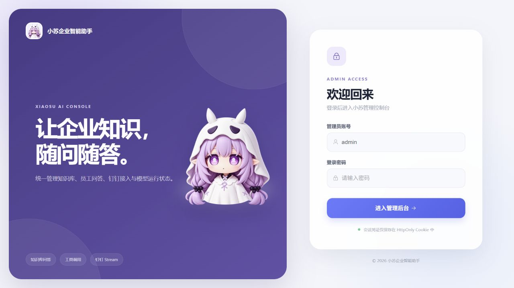
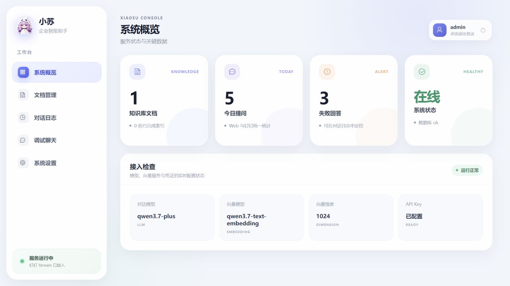
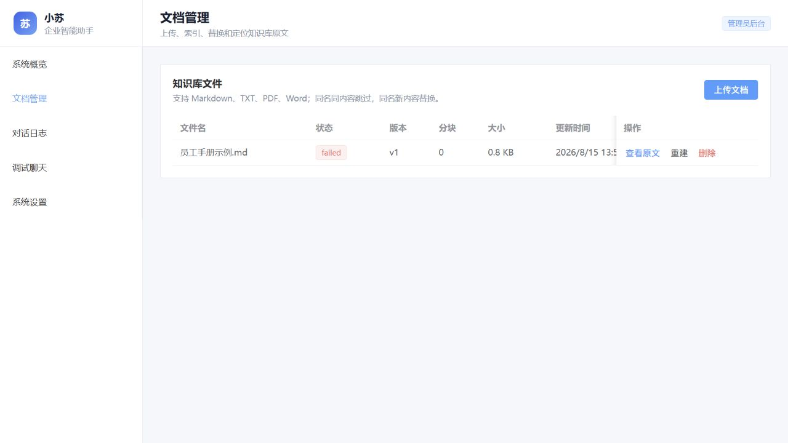
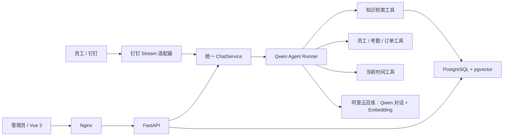

# 小苏企业智能助手

小苏是面向企业员工的内部 AI 助手。员工可以在钉钉群聊或私聊中查询公司制度、员工、考勤、订单和当前时间；管理员通过 Vue Web 后台维护知识库、定位引用原文、查看工具调用与 Token 日志，并使用调试聊天页现场演示。







## 已实现功能

- Markdown、TXT、PDF、DOCX 上传、解析、删除和重建索引。
- 同名同内容跳过；同名新内容更新版本并替换旧向量。
- Qwen3.7 Plus Function Calling 自主选择知识检索、员工、考勤、订单和时间工具。
- Qwen3.7 Text Embedding + PostgreSQL/pgvector 语义检索。
- 回答携带文件、章节、页码/段落和可点击原文定位；低相关度时强制拒答。
- 按平台、企业、会话、用户四个维度隔离多轮上下文。
- 千问模型原生 Token 流通过 SSE 实时推送，Nginx 关闭缓冲；模型异常和无效 Key 均有友好兜底。
- 钉钉 Stream 长连接机器人，无需公网回调地址。
- 管理后台包含概览、文档、原文定位、带用户筛选/分页的对话日志、模型设置和调试聊天。
- 调试聊天按事件实时展示“理解问题、检索知识、调用工具、组织答案”等可审计处理阶段，正文逐 Token 增量渲染，不暴露模型私密思维链。
- 管理后台使用签名 HttpOnly Cookie 会话，未登录无法访问文档、对话、设置和 Mock API。
- 结构化文件日志、请求 ID、依赖健康检查、Token/成本/耗时记录。
- 20 条离线测试（含登录会话、原生流式事件与 Mock LLM）和 20 条真实链路 Evals。

## 架构



关键设计是让 Web 与钉钉只做协议适配，全部复用 `ChatService → AgentRunner → ToolExecutor`。新增飞书或企业微信时，不需要重写 RAG、工具和日志逻辑。

## 技术栈

| 层级 | 技术 |
|---|---|
| Web | Vue 3.5、TypeScript 5.9、Vite 7、Element Plus 2 |
| API | Python 3.12+、FastAPI、Pydantic、SQLAlchemy Async |
| AI | Qwen3.7 Plus、Qwen3.7 Text Embedding、OpenAI 兼容协议 |
| 数据 | PostgreSQL 16、pgvector |
| IM | 钉钉 Stream SDK |
| 工程 | uv、pnpm、pytest、Ruff、Docker Compose、Nginx |

## 目录结构

```text
apps/api/             FastAPI、Agent、RAG、钉钉适配与测试
apps/web/             Vue 管理后台
data/documents/       9 份多格式演示知识库（约 1.7 MB）
docker/               API/Web 镜像与 Nginx 配置
docs/                 模型、钉钉配置和界面截图
scripts/              启停、测试、检查、造数和 Evals
logs/                 运行日志（内容不进 Git）
uploads/              上传文件（内容不进 Git）
```

## 快速开始

### 1. 准备配置

```bash
cp .env.example .env
```

在本机 `.env` 至少填写：

```dotenv
DASHSCOPE_API_KEY=你的百炼API-Key
ADMIN_USERNAME=admin
ADMIN_PASSWORD=请设置管理员密码
SESSION_SECRET=请设置一段足够长的随机字符串
```

若旧环境只填写了 `ADMIN_TOKEN`，系统会暂时将它同时用作登录密码和会话签名密钥。新部署建议分别配置 `ADMIN_PASSWORD` 与 `SESSION_SECRET`。对话与 Embedding 共用同一把百炼 Key。`.env` 已被 Git 忽略，禁止使用 `git add -f`。模型和地域配置参见 [千问模型配置](docs/model-configuration.md)。

### 2. 一条命令启动

```bash
./scripts/start.sh
```

也可以直接运行：

```bash
docker compose up --build
```

启动后访问：

- 管理后台：<http://localhost:5173>
- OpenAPI：<http://localhost:8000/docs>
- 健康检查：<http://localhost:8000/api/v1/health/dependencies>

Windows 建议使用 WSL/Git Bash 执行脚本；也可在 PowerShell 中运行 `docker compose up --build`。Docker Desktop 如果无法处理含中文的项目路径，请将仓库放到纯英文目录。

首次进入管理后台会跳转登录页。用户名来自 `ADMIN_USERNAME`，密码来自 `ADMIN_PASSWORD`；兼容模式下密码为 `ADMIN_TOKEN`。

### 3. 导入演示文档

确认 API Key 有效、服务已启动后执行：

```bash
./scripts/seed.sh
```

演示库覆盖员工制度、入职、40 条 FAQ、信息安全、会议室与访客、差旅报销、IT 设备账号和销售服务规范，包含 Markdown、TXT、DOCX 与 PDF。需要重新生成这些样例时执行 `./scripts/generate_samples.sh`。

文档页会显示 `pending → indexing → indexed`。如果先在未填写 Key 时上传，文件会保留为 `failed`，填写 Key 并重启后点击“重建”即可。

### 4. 启动钉钉机器人

先按照 [钉钉接入指南](docs/dingtalk-setup.md) 创建企业内部应用并发布机器人版本，然后填写：

```dotenv
DINGTALK_CLIENT_ID=应用Client ID
DINGTALK_CLIENT_SECRET=应用Client Secret
PUBLIC_BASE_URL=https://你的管理后台域名
```

启动包含机器人的完整环境：

```bash
docker compose --profile dingtalk up --build -d
```

## 本地开发

后端：

```bash
cd apps/api
uv sync
uv run uvicorn xiaosu.main:app --reload
```

前端：

```bash
pnpm install
pnpm --filter @xiaosu/web dev
```

前端开发服务器会将 `/api` 代理到 `http://localhost:8000`。

## 测试与质量检查

```bash
./scripts/test.sh
./scripts/lint.sh
uv run --project apps/api python scripts/check_stream.py
```

前两项为离线检查；`check_stream.py` 会连接本机 API 与真实模型，逐行打印 SSE 状态和 Delta 到达时间，用于确认响应没有被前端或代理缓冲。离线测试包括：Mock LLM 工具选择、模型原生流式事件、知识库拒答覆盖、钉钉会话隔离、多格式解析、切片与 Mock 内部 API。

真实模型 Evals 需要先填写 Key、启动服务并导入文档：

```bash
./scripts/eval.sh
```

评测集包含 20 条知识、工具、多轮、拒答与边界用例，默认通过率阈值为 80%。

## 核心 API

| 方法 | 地址 | 说明 |
|---|---|---|
| POST | `/api/v1/auth/login` | 管理员登录并写入 HttpOnly Cookie |
| GET | `/api/v1/auth/me` | 检查当前登录会话 |
| POST | `/api/v1/auth/logout` | 退出并清除会话 |
| POST | `/api/v1/documents` | 上传并索引文档 |
| GET | `/api/v1/documents` | 文档与索引状态列表 |
| DELETE | `/api/v1/documents/{id}` | 删除文档和向量 |
| POST | `/api/v1/chat/stream` | SSE 调试对话 |
| GET | `/api/v1/admin/messages` | 用户与回答日志 |
| GET/PATCH | `/api/v1/admin/settings` | 查看状态、临时切换模型 |
| GET | `/api/v1/mock/employees/{id}` | Mock 员工信息 |
| GET | `/api/v1/mock/employees?name=张三` | 按姓名查员工，供后续考勤工具调用 |
| GET | `/api/v1/mock/attendance` | Mock 考勤查询 |
| GET | `/api/v1/mock/orders` | Mock 订单汇总 |

## 面试演示问题

1. 员工每年有几天年假？
2. 报销发票需要哪些材料？
3. 新人入职第一天要做哪些事？
4. 员工 001 是哪个部门的？
5. 上周一共多少订单？
6. 现在几点？
7. 接着第 4 题问：他上周来上班几天？
8. 我们公司 CEO 的家庭住址是？

知识回答应出现可点击引用；动态问题应在日志中出现对应工具；第 8 题应拒答。

## 安全与运行数据

- 所有密钥只从 `.env` 或部署平台 Secret 读取，健康与设置接口只返回“是否配置”。
- 管理端 API 默认要求签名 HttpOnly Cookie；会话默认 8 小时过期，生产环境 Cookie 自动启用 Secure。
- 上传文件使用随机存储名，限制 20 MB，仅接受 md/txt/pdf/docx。
- 模型温度为 0.1，网络调用带超时与指数重试。
- `logs/app.jsonl` 为轮转 JSON 日志；`uploads/`、`logs/`、`.env` 均不提交。
- 当前实现单管理员登录，公开部署时仍建议接入公司 SSO、限流与角色权限。

## Roadmap

- [x] 文档增量索引、引用定位和强制拒答
- [x] Agent 自主 Function Calling 与多轮上下文
- [x] 钉钉 Stream、Web 管理后台、Token/成本展示
- [x] 管理后台登录、签名 Cookie 与受保护 API
- [x] Mock LLM 测试和 20 条 Evals
- [x] 千问模型原生 Token 流、Web 处理阶段与 SSE 协议
- [ ] 企业 SSO 与细粒度角色权限
- [ ] 交互式钉钉 AI 卡片
- [ ] Alembic 生产迁移和 OpenTelemetry/Langfuse 链路

完整题目逐项核对见 [功能验收矩阵](docs/requirements-audit.md)。
